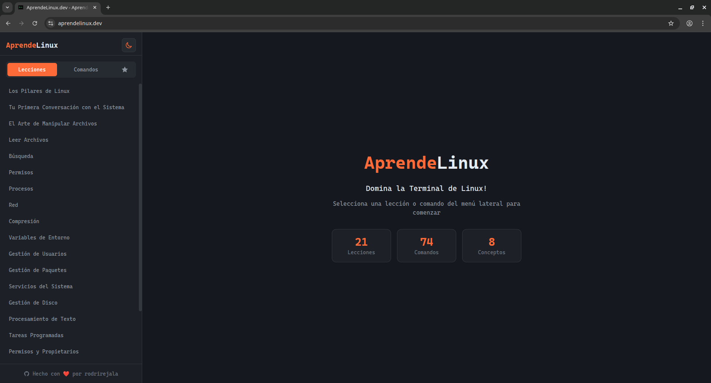
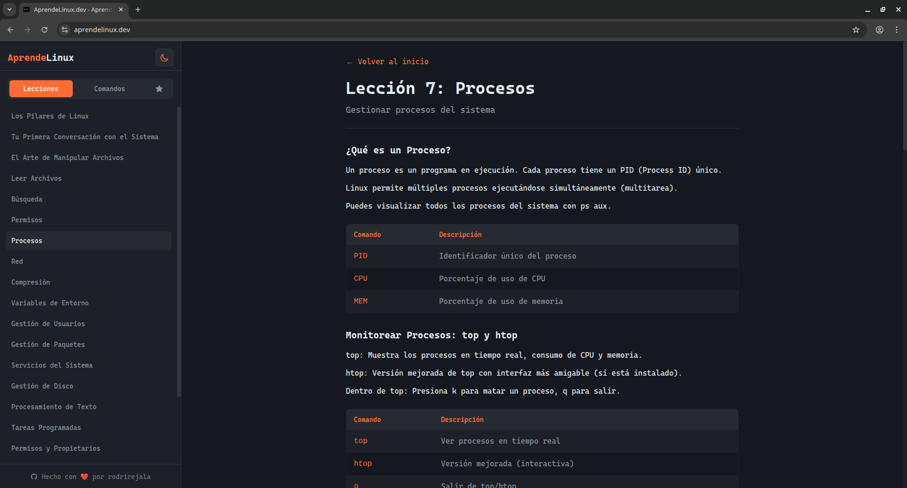
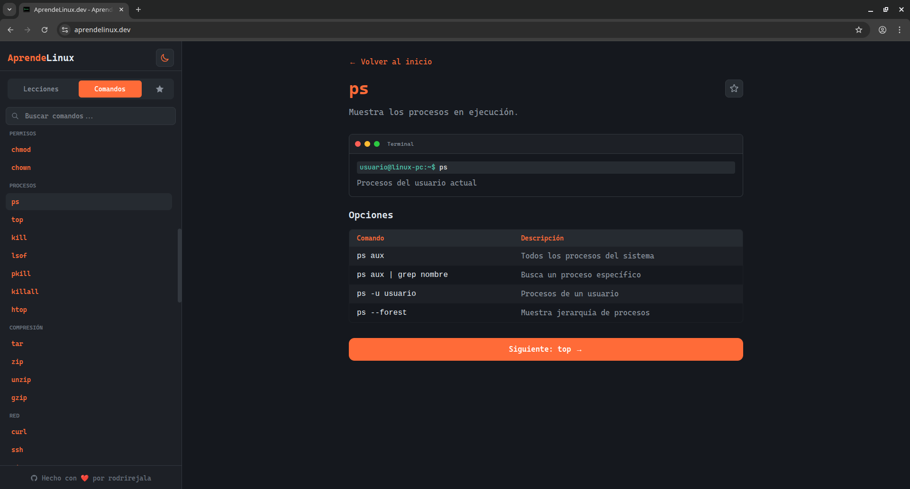
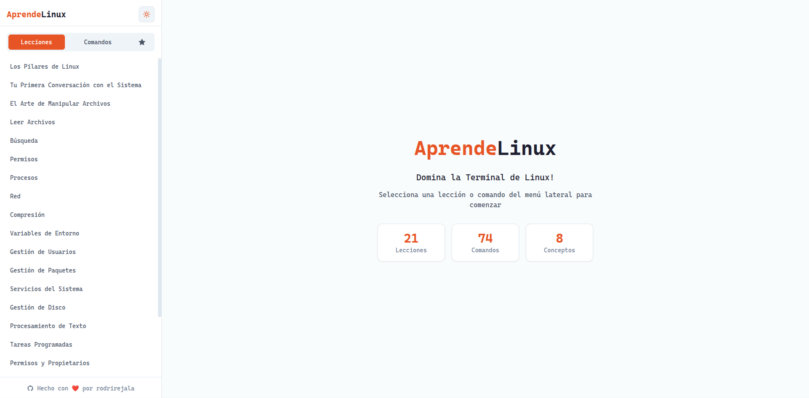

# AprendeLinux.dev 🐧

> Aprende Linux de forma práctica y progresiva desde cero

[](https://opensource.org/licenses/MIT)

# aprendelinux.dev desplegado y listo 🚀

[](https://aprendelinux.dev)


Un recuerso para aprender Linux, desde los conceptos más básicos hasta lo mas avanzados. Todo en una interfaz moderna y fluida.

## 🔗 Enlace del Proyecto

Puedes ver la aplicación en vivo aquí:  
👉 **[https://aprendelinux.dev](https://aprendelinux.dev)**

## 📸 Preview









## 📚 Contenido

El proyecto incluye **21 lecciones** estructuradas para aprender Linux de forma progresiva:

### Lecciones

| # | Título | Dificultad |
|---|--------|------------|
| 1 | Los Pilares de Linux | Principiante |
| 2 | Tu Primera Conversación con el Sistema | Principiante |
| 3 | El Arte de Manipular Archivos | Principiante |
| 4 | Leer Archivos | Principiante |
| 5 | Búsqueda | Principiante |
| 6 | Permisos | Principiante |
| 7 | Procesos | Intermedio |
| 8 | Red | Intermedio |
| 9 | Compresión | Intermedio |
| 10 | Variables de Entorno | Intermedio |
| 11 | Gestión de Usuarios | Intermedio |
| 12 | Gestión de Paquetes | Intermedio |
| 13 | Servicios del Sistema | Intermedio |
| 14 | Gestión de Disco | Intermedio |
| 15 | Procesamiento de Texto | Intermedio |
| 16 | Tareas Programadas | Intermedio |
| 17 | Permisos y Propietarios | Intermedio |
| 18 | Gestión de Procesos | Intermedio |
| 19 | Redes Básicas | Intermedio |
| 20 | Scripts Básicos | Avanzado |
| 21 | Pipelines y Combos de Comandos | Avanzado |

### Características

- 📖 **21 lecciones** cubriendo desde conceptos básicos hasta avanzados
- 💻 **+50 ejercicios prácticos** para cada lección
- 📚 **Catálogo de comandos** de terminal organizado por categorías
- 🎨 **Syntax highlighting** en ejemplos de código (tema GitHub Dark)
- 🌙 **Modo oscuro/claro** integrado
- 🔍 **Búsqueda** de comandos en tiempo real

## 🛠️ Tecnologías

| Tecnología | Versión | Propósito |
|------------|---------|-----------|
| **Astro** | ^6.0.8 | Framework principal - rendimiento óptimo |
| **Tailwind CSS** | ^4.2.2 | Estilos utility-first |
| **Shiki** | ^4.0.2 | Syntax highlighting server-side |

## 🚀 ¿Por qué estas tecnologías?

### Astro

- **Rendimiento superior**: El contenido se pre-renderiza en build time, generando HTML estático
- **Island Architecture**: Solo el JavaScript necesario se carga en el cliente
- **Zero JS por defecto**: La página principal carga prácticamente sin JavaScript
- **Excelente DX**: Componentes simples sin complejidad innecesaria

### Tailwind CSS

- **Desarrollo rápido**: No necesitas cambiar archivos CSS separados
- **Consistencia**: Sistema de diseño integrado con variables CSS
- **Personalizable**: Soporte nativo para temas claros/oscuros
- **Purge friendly**: Solo incluye las clases que usas en el build final

### Shiki

- **Server-side rendering**: El syntax highlighting se genera en build, no en el cliente
- **Sin JavaScript extra**: No carga librerías en el navegador para resaltar código
- **Temas hermosos**: Integración perfecta con temas populares como GitHub Dark
- **Performance**: Generación en build, cero overhead en runtime

## 🚀 Despliegue e Infraestructura

Este proyecto se encuentra desplegado utilizando una arquitectura de alto rendimiento y control total, aprovechando las capacidades de **CubePath** y el orquestador **Dokploy**.

### 🏗️ Stack Tecnológico
* **Hosting:** [CubePath](https://cubepath.com/) (VPS Cloud de alta disponibilidad).
* **PaaS:** [Dokploy](https://dokploy.com/) (Gestión de contenedores y despliegue continuo).
* **Framework:** [Astro](https://astro.build/).

### 🛠️ Configuración del Servidor
Para garantizar un despliegue ágil y escalable, segui este flujo:

1.  **Aprovisionamiento en CubePath:**
    * Utilize la opción de **"Apps 1-Click"** de CubePath para levantar un VPS optimizado con **Dokploy**. Esto me permitió saltarnos la configuración manual del servidor. 
3.  **Gestión con Dokploy:**
    * Configure un panel de control autogestionado dentro del VPS.
    * Conecte este repositorio de GitHub para habilitar **CI/CD** automático.
4.  **Build de Astro:**
    * Dokploy se encarga de detectar los cambios en la rama principal, ejecutar el proceso de construcción de Astro y servir los archivos estáticos (o SSR) mediante un contenedor Docker optimizado.

# 📂 Estructura del Proyecto

```
/
├── src/
│   ├── data/
│   │   ├── lecciones.ts      # Contenido de las lecciones
│   │   ├── comandos.ts       # Catálogo de comandos
│   │   └── conceptos.ts      # Conceptos fundamentales
│   ├── layouts/
│   │   └── Layout.astro     # Layout principal
│   ├── pages/
│   │   └── index.astro      # Página principal (SPA)
│   ├── styles/
│   │   └── global.css       # Estilos globales
│   └── env.d.ts             # Tipos de entorno
├── public/                  # Assets estáticos
├── dist/                    # Build de producción
├── astro.config.mjs         # Configuración de Astro
├── tailwind.config.mjs     # Configuración de Tailwind
└── package.json
```

## 🤝 Contribuciones

¡Las contribuciones son bienvenidas! Si quieres mejorar el contenido, corregir errores o agregar nuevas lecciones:

1. Fork el repositorio
2. Crea una rama (`git checkout -b feature/nueva-leccion`)
3. Commit tus cambios (`git commit -am 'Agregar nueva lección'`)
4. Push a la rama (`git push origin feature/nueva-leccion`)
5. Abre un Pull Request

## 📄 Licencia

Este proyecto está bajo la licencia [MIT](LICENSE).

---

🇪🇸 Hecho con ❤️ para la comunidad de Linux en español
